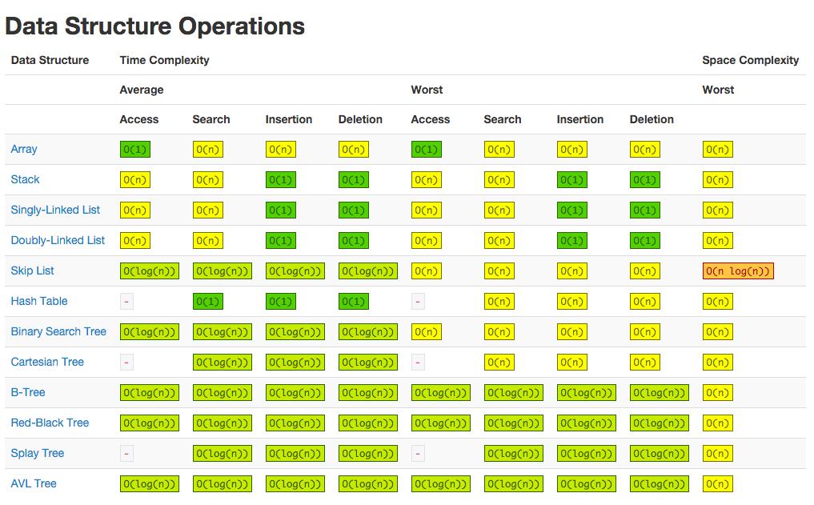
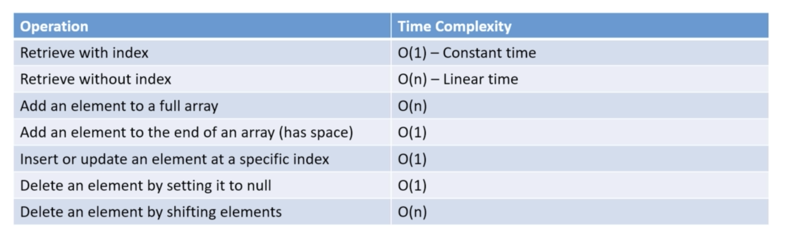

# Data structures and Algorithms

### Data Structure Operation Efficiency 

## Arrays
- Contiguous Block of memory
- Each array is allocated same memory (in case of objects references are stored)

## _Big O of an Array_

## Sorting Algorithms

### _Stable vs Unstable_

If there are duplicates in the array and the relative order of equal elements is preserved then algo is stable

### _Bubble Sort - O(n^2)_
- iterate each element over the whole array while swapping adjacent index if greater than current value, we move from right to left
- lastUnsortedIndex will make it more efficient but worst case is O(n^2)
- Stable Algorithm

### _Selection Sort - O(n^2)_
- lastUnsortedIndex is last index of unsorted partition, we move from right to left
- assume largest element is at 0th location (largeLoc) and then compare it across the array starting from index 1 while changing largeLoc if we find a larger element
- at end of each iteration swap the largeLoc with lastUnsortedIndex
- does less swapping compared to bubble sort
- Unstable Algorithm

### _Insertion Sort - O(n^2)_
- firstUnsortedIndex is 1, we traverse from left to right, we insert the number to the lowest possible location and replace the existing location with number stored in start
- works great with already sorted list, linear time
- Stable Algorithm

### _Shell Sort - O(n^2)_
- Basically in Insertion Sort we have a gap value of 1 (we compare with adjacent data), whereas in Shell we increase the gap
- Knuth Algo says gap should be - (3^k-1)/2
- We do this to minimize the no of insertions
- Unstable Algorithm

### _Merge Sort - O(nlogn)_
- Divide and Conquer Algorithm - recursive
- Splitting and merge.
- Split till 1 element array and merge them back (while sorting) into original size, keep on doing till sorting is complete
- Stable Algorithm

### _Quick Sort - O(nlogn)_
- Divide and Conquer Algorithm - recursive
- Uses Pivot to partition the array
- Put all element smaller than the pivot to left, larger than pivot to the right, pivot is in correct sortedPosition
- Worst is O(n^2)
- Unstable Algorithm

### _Counting Sort - O(n)_
- Assumes range of number present
- Doesn't compare, works only with positive numbers , Will have to create an array with maxValue present better for smaller range
- Creates a tempArray and increments count at index for a particular value in input. for eg: val 10, increment count at index 10
- Unstable Algorithm

### _Radix Sort - O(n)_
- Assumes range of number present, data has same radix(Binary: 2, Alphabet:26) and width(Number of chars in each data)
- Works only with integers or strings , Sort based on each individual digit or letter position
- Start at the rightmost position 
- Stable (Counting) Algorithm

### _Bucket Sort - O(n)_
- Uniformity assumptions means that each bucket will have only a few (maybe n) elements after the pass.
- Work on hashing
- Start at the rightmost position
- Unstable (Counting) Algorithm
- Collection.sort uses Adaptive merge sort where as arrays.sort uses double pivot quick sort

## LinkedList

- Is a DS on its own - uses object to create Node and pointer to next node
- Best for resizing, removing, adding
- Worst for iterating, searching.
- Best when it comes to writing recursion hence used in Scala as a base DS for List, also because we don't need to worry about resizing
- Three Types : Singly, Doubly and Circular LinkedList

## Stack
- Abstract Data Type - is not a DS on it owns uses other DS for implementation
- Can be implemented by using Arrays and LinkedList
- LinkedList is better provided we can use its direct function, we don't need to resize it
- LIFO logic
- Java recommends not to use its Stack class and better use Dequeue

## Queue
- Abstract Data Type - is not a DS on it owns uses other DS for implementation
- Can be implemented by using Arrays and LinkedList
- LinkedList is better provided we can use its direct function, we don't need to resize it
- FIFO logic

## Hashtables
- Runs on principle of hashing on key and storing values in respective bucket
- There can be hash collision, hence hash calculation is important
- There are two ways to handle collision - Linear Probing and Chaining

## Binary Search Tree
- Can perform insertion, deletion, retrieval in O(logn)
- Left child always has smaller value than its parent
- Right child always has larger value than its parent
- Already sorted data will result in O(n) complexity

## [Questions N Solutions]()
